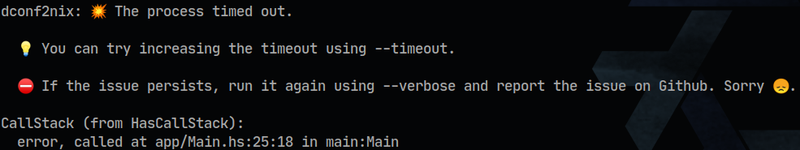

# dconf2nix

[](https://github.com/gvolpe/dconf2nix/actions)

A convenient converter of [DConf](https://wiki.gnome.org/Projects/dconf) files to Nix, as expected by [Home Manager's dconf settings](https://rycee.gitlab.io/home-manager/options.html#opt-dconf.settings). So you can Nixify your [Gnome Shell](https://wiki.gnome.org/Projects/GnomeShell) configuration :wink:

---

### Benchmarks

Take it with a grain of salt but on my machine it takes an average of 7.1ms to process a 349 lines configuration and generate a Nix file with 433 lines.


### Introduction

Given the following `dconf` settings:

```init
[ org/gnome/desktop/peripherals/mouse ]
natural-scroll=false
speed=-0.5

[ org/gnome/desktop/peripherals/touchpad ]
tap-to-click=false
two-finger-scrolling-enabled=true

[org/gnome/desktop/input-sources]
current=uint32 0
sources=[('xkb', 'us')]
xkb-options=[' terminate:ctrl_alt_bksp ', ' lv3:ralt_switch ', ' caps:ctrl_modifier ']

[ org/gnome/desktop/screensaver ]
picture-uri=' file:///home/gvolpe/Pictures/nixos.png '
```

You will get the following output when running `dconf2nix`:

```nix
{ lib, ... }:

let
  mkTuple = lib.hm.gvariant.mkTuple;
in
{
  dconf.settings = {
    "org/gnome/desktop/peripherals/mouse" = {
      "natural-scroll" = false;
      "speed" = -0.5;
    };

    "org/gnome/desktop/peripherals/touchpad" = {
      "tap-to-click" = false;
      "two-finger-scrolling-enabled" = true;
    };

    "org/gnome/desktop/input-sources" = {
      "current" = "uint32 0";
      "sources" = [ (mkTuple [ "xkb" "us" ]) ];
      "xkb-options" = [ "terminate:ctrl_alt_bksp" "lv3:ralt_switch" "caps:ctrl_modifier" ];
    };

    "org/gnome/desktop/screensaver" = {
      "picture-uri" = "file:///home/gvolpe/Pictures/nixos.png";
    };
  };

}
```

It makes use of the Home Manager's [dconf.settings](https://rycee.gitlab.io/home-manager/options.html#opt-dconf.settings) key.

You can make changes in the UI and create a dump of your `dconf` file at any time, which you can Nixify so Home Manager can restore the next time you run `home-manager switch`. To create a dump, run the following command:

```shell
dconf dump / > dconf.settings
```

### Run

Once compiled and installed (via `nix-build` or `cabal new-install`), you can use it as follows:

```shell
dconf2nix -i data/dconf.settings -o output/dconf.nix
```

It is also possible to pipe the standard input to `dconf2nix` and expect the result in the standard output:

```shell
dconf dump / | dconf2nix > dconf.nix
```

Type `--help` for some more information.

```shell
dconf2nix - Nixify dconf configuration files

Usage: dconf2nix [-v|--version]
                 [[-t|--timeout ARG] [--verbose] | (-i|--input ARG)
                   (-o|--output ARG) [-t|--timeout ARG] [--verbose]]
  Convert a dconf file into a Nix file, as expected by Home Manager.

Available options:
  -h,--help                Show this help text
  -v,--version             Show the current version
  -t,--timeout ARG         Timeout in seconds for the conversion
                           process (default: 5)
  --verbose                Verbose mode (debug)
  -i,--input ARG           Path to the dconf file (input)
  -o,--output ARG          Path to the Nix output file (to be created)
  -t,--timeout ARG         Timeout in seconds for the conversion
                           process (default: 5)
  --verbose                Verbose mode (debug)
```

### Supported types

For now, only types supported by Home Manager as specified [here](https://github.com/rycee/home-manager/blob/master/modules/lib/gvariant.nix) are supported. If there's enough interest, we might be able to work on supporting the [full specification](https://developer.gnome.org/glib/stable/gvariant-text.html).

Due to the lack of support, `dconf2nix` parses dictionaries and list of variants as simple strings to avoid failing to parse a file and retain most of the information.

### Gnome Shell configuration

Once you have your `dconf.nix`, you can import it via Home Manager.


```nix
{
  programs.home-manager.enable = true;

  imports = [
    ./programs/gnome/dconf.nix
  ];
}
```

You can have a look at my [NixOS configuration files](https://github.com/gvolpe/nix-config/tree/master/nixos/home) as an example.

### Installation

The simplest way is to install it via `nix-env`.

```shell
nix-env -i dconf2nix
```

Or if you want to pull the latest `master`.

```shell
nix-env -i -f https://github.com/gvolpe/dconf2nix/archive/master.tar.gz
```

You could also use [Cachix](https://app.cachix.org/cache/dconf2nix) to reduce the installation time.

Alternatively, here's a derivation for the binary you can use to avoid compiling it (only for Linux-x86-64 for now).

```nix
{ stdenv }:

stdenv.mkDerivation rec {
  name    = "dconf2nix-${version}";
  version = "v0.0.5";

  src = builtins.fetchurl {
    url    = "https://github.com/gvolpe/dconf2nix/releases/download/${version}/dconf2nix-linux-x86-64";
    sha256 = "1hidf1vwsi8hmmf3vv4n1dvqs5wyk9xhly7bdckxqkqsq2gb44dg";
  };

  phases = ["installPhase" "patchPhase"];

  installPhase = ''
    mkdir -p $out/bin
    cp $src $out/bin/dconf2nix
    chmod +x $out/bin/dconf2nix
  '';
}
```

Have a look at the [latest releases](https://github.com/gvolpe/dconf2nix/releases) in case the README file gets outdated.

### Troubleshooting



The default timeout is of 5 seconds. You can see it by running `dconf2nix --help`.

To report an issue, please copy the first value you see in the console when running in `--verbose` mode. That is basically the raw `dconf` value that cannot be parsed. Do also consider the caveats mentioned above in the [Supported Types](#supported-types) section.

### Development

To compile and run the tests locally.

```shell
cabal new-configure
cabal new-run dconf2nix-tests
```

To generate the static binary.

```shell
cabal new-configure --disable-executable-dynamic --ghc-option=-optl=-static --ghc-option=-optl=-pthread
nix-build
```

If everything goes well, the binary should be under `result/bin/`.
